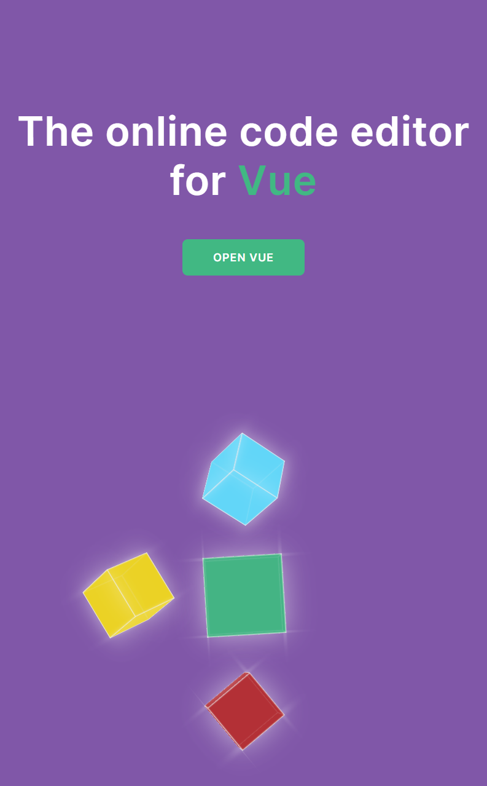

# 3D LANDING PAGE

CODE AND CREATE youtube channel inspired this project.
[LINK TO THE YOUTUBE VIDEO](https://www.youtube.com/watch?v=9m9C7Las-V0).

I learnt a few new CSS properties like the transforms-style(3D-preserve), practiced the use of some array and string method most especially a new trick utilizing type coercion on how to convert string to number by multiplying the string number by 1 e.g "32" \* 1 => 32.

I also made it responsive using my favorite CSS Grid

